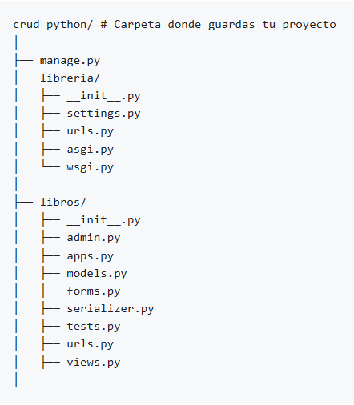

#  **Investigación sobre Django**

##  **Parte 1: Aplicación CRUD y Django**
**1. ¿Qué es un CRUD  y cuál es su propósito en el desarrollo de aplicaciones web?**   
   Es un acrónimo que representa las operaciones básicas que pueden realizar dobre los datos:
   * **C** = Create 
   * **R** = Read
   * **U** = Update
   * **D** = Delete
      
   Su propósito es manejar datos(base datos) , diseñar interfaces(formularios, etc), organización
   del código(crear APIS). 
   **Ejemplo:** 
   La app de Amazon que usamso en el mobil es un ejemplo de un CRUD ya que te permite 
   CREATE  una cuenta, agregar productos, READ  navegar por productos, lees descripciones,
   etc.Ademas te permite UPDATE , cambiar tu direccion,  modificar el carrito y hacer 
   un DELETE, eliminar productos de un carrito, cancelar pedidos, etc.   
**2. ¿Qué son los patrones  de arquitectura en desarrollo de software?**    
   Es una guia a seguir(ex. planos) para construir nuestras aplicaciones de la manera más organizada sea más facil de
     
   mantener  en un futuro.  
   **¿Qué es el patrón MVC (Modelo–Vista–Controlador)?**  
      Divide la app en tres partes: datos(modelo), pantalla(vista) y vista lógica(controlador) 
    **¿Qué es el patrón MVT (Modelo–Vista–Template)?**  
     Es una forma de construir aplicaciones web. Se divide en tres partes:logica datos(modelo), logica de 
     presentación(vista)  
     y la   manera como se muestran los datos al usuario (Template). Es utilizado por el framework  Django 
    **Diferencias entre MVC y MVT** 
     En MVC, el **Controlador** es quien maneja la lógica de la aplicación y decide que mostrar.
     Mientras que en  **MVT** la lógica la maneja la **Vista**  y el **Template** se encargade mostrar los datos. 
    **¿Cuál de estos dos patrones se usa en Django?** 
     Django utiliza el **MVT** tu defines el modelo , la vista( lógica ) y el template( con HTML) y Django conecta 
     todo.  
 **3. ¿Cómo se estructura un proyecto en Django? Explicar brevemente el rol de los 
    modelos, vistas, templates y URLs.**  
    Cuando creas un proyecto en **Django** se divide en **modulos(apps)** y cada app tiene un componente clave.  
    Django tiene los siguientes componentes
 * **Modelos**:
       Definen los datos que se guardan en la base de datos.(Una entidad con sus atributos)
 * **Vistas**:
       Procesan la logica y deciden que mostrar. (Mostrar los productos disponibles)
 * **Templates**: 
       Son las páginas HTML que ve el usuario (Una pagina con fotos, precios de los productos)
 * **URLs**: 
       Conectan direcciones web con vistas (/productos/ muestra la lista de productos).
  
 

     
 

 
   **¿Para qué se usa el signo “%%” en los templates?**  
    Se usa para **Evitar errores** cuando el simbolo  % podria confuncdirse con instrucciones de formato.
    El doble %% se convierte en un solo % cuando se muestra. 
    Ex. 
    mensaje = "Descuento del 20%%"  
**4. ¿Cuál es el flujo de datos entre un formulario HTML y la base de datos en Django?**  
    **Primero:** El usuario introduce los datos(nombre, email , dirección) y luego damos click a Enviar 
    y se genera un peticion **POST**. 
    **Segundo:** Django recibe esta informacion en una **vista** que maneja este formulario y crea una            instancia del **formulario Django** (ModelForm). 
    **Tercero:** El formulario verifica si los datos son válidos. Revisa formatos, campos obligatorios, etc.      
    **Cuarto:** Si los datos son válidos, Django guarda la información , Django traduce este paso a una 
    instruccion SQL que inserta el registro en la base de datos. 
    **Quinta:** Muestra un mensaje de exito o presenta una nueva vista.  
**5. ¿Qué herramientas o comandos ofrece Django para facilitar el desarrollo de un 
CRUD, para qué es cada una? (Por ejemplo: startapp, makemigrations, 
migrate, runserver, ModelForm, admin, etc.)** 
     Django te ofrece comandos para crear un sistema CRUD(Crear, Leer, Actualizar y Eliminar)  
   *  **Startapp:** Crea una estructura básica de una nueva aplicación Django 
   *  **makemigrations:** Detecta cambios en tus modelos y genera archivos de migración(definen la BD) 
   *  **migrate:** Aplica las migraciones a la base de datos para crear o actualizar tablas  
   *  **runserver:** Inicia el servidor local para que puedas ver y probar tu app en el navegador  
   *  **ModelForm:** Crea formularios automaticamente basados en modelos para facilitar el CRUD. 
   *  **admin:**: Interfaz administrativa lista para usar, permite gestionar tus modelos facilmente  
**6. ¿Cómo funciona el Admin de Django?** 
 Es como un asistente personal que te ayuda a gestionar tus datos(tu base de datos) desde una interfaz web  sin escribir codigo de interfaz .Es como tenetr un panel de control para tus modelos 
   
 
   
   
   .
